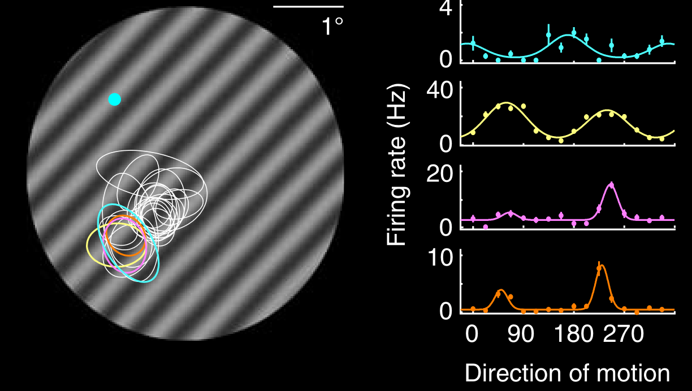
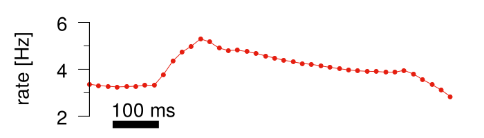
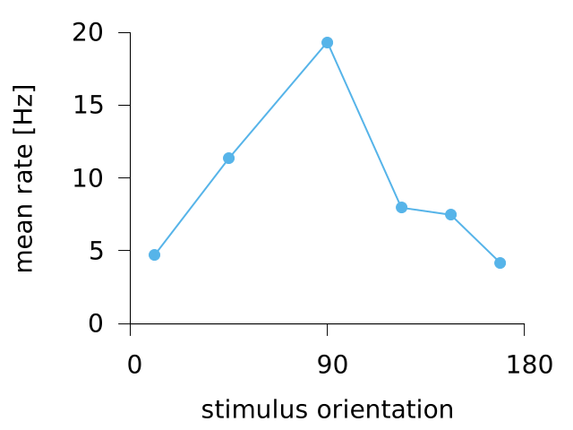
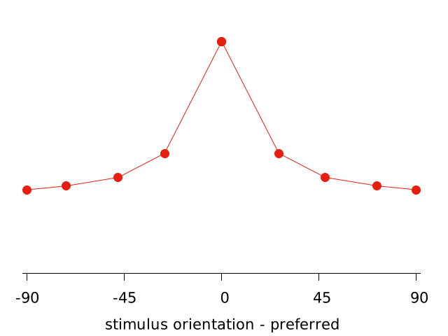
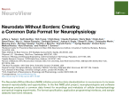

<!-- <<<1 Title slide -->
# Analyse data like a pro

A short intro to SQL &mdash; by an amateur <!-- .element style="font-size: 100%" -->

 

CBL Tea talk, May 2017 <!-- .element style="font-size: 80%" -->
 
Guillaume Hennequin <!-- .element style="font-size: 80%" -->

<!-- <<<1 The problem -->
---
<!-- .slide: data-class="out" --> 
## The problem

Data analysis (e.g. in neuroscience):

Ecker et al., <i>Nature</i> (2010)

- recordings of neural activity in various conditions
  <!-- .element: class="fragment" -->
- heterogeneous entries (think high-D array with tons of missing data)
  <!-- .element: class="fragment" -->
- want to slice the data in various, sometimes complex, ways
  <!-- .element: class="fragment" -->
- even for simple questions, Matlab will drive you crazy
  <!-- .element: class="fragment" -->

 

There's a <b>language</b> for exactly this kind of problems: <b>SQL</b>

<!-- .element: class="fragment" -->

<!-- <<<1 Meet SQL -->
---

## Meet SQL

(Structured Query Language)

<pre><code class="sql">
SELECT avg(orientation), avg(response)
FROM spikes JOIN conditions USING (condition)
WHERE time BETWEEN 20 AND 50 AND unit=1
GROUP BY floor(orientation/22.5)
</code></pre>

Philosophy (&lsquo;declarative&rsquo;):

Write down what you want, 
let the program figure out how to do it.

The language is supported by an ecosystem of:

- various instantiations of the language specs (Oracle, PostgreSQL, MySQL, SQLite, ...),
- bindings to access these libraries from your favorite high-level language,
- interactive interpreters,
- distributed infrastructure, ... etc.

<!-- .element: class="fragment" -->

<!-- <<<1 Tables -->
---

## Step 1: create a database

Table 'cells'

| unit   | recording | contamination |
|:------:|:-------:|:-------------:|
| 1      | 1       | 0.021         |
| 2      | 1       | 0.018         |
| ...    | ...     | ...           |
| 45     | 2       | 0.060         |
| 46     | 2       | 0.002         |
| ...    | ...     | ...           |

<pre><code class="sql">
CREATE TABLE cells (unit INT, recording INT, contamination FLOAT)
INSERT INTO cells VALUES (1, 1, 0.021)
...
</code>
</pre>

<!-- .element: class="fragment" -->

---

Table 'conditions'

| condition | orientation | contrast |
|:---------:|:-----------:|:--------:|
| 1      | 45       | 10         |
| 2      | 90       | 100        |
| ...    | ...     | ...           |

---

Table 'spikes'

| unit | condition | time | trial | response |
|:----:|:---------:|:----:|:-----:|:--------:|
| 1 | 1 | 8 | 1 | 0 |
| 1 | 1 | 8 | 2 | 3 |
| ... | ... | ... | ... |
| 1 | 2 | 8 | 1 | 6 |
| 1 | 2 | 8 | 2 | 2 |
| ... | ... | ... | ... | ... |
 

<!-- <<<1 Simple queries -->
---

## Simple queries
 
Already useful for simple things such as:

<pre><code class="sql">
/* how many cells do we have in total? */
SELECT count(*) FROM cells

/* how many cells are decently isolated? */
SELECT count(*) FROM cells WHERE contamination < 0.05 

/* how many cells were recorded simultaneously, on average? */
SELECT avg(n_cells) FROM 
(SELECT count(*) as n_cells FROM cells GROUP BY recording)

/* how many trials in each condition? */
SELECT max(trial) FROM spikes GROUP BY condition
   
/* what's the mean firing rate just after stimulus onset? */
SELECT avg(response) FROM spikes WHERE time=20
</code></pre>

---

You can even pipe output into Gnuplot for graphical exploration:

<pre><code class="gnuplot">
plot '< sqlite3 -separator " " statgrad.db \
   "SELECT time, avg(response) FROM spikes 
    GROUP BY time ORDER BY time ASC"' with [... linestyle ...]
</code></pre>

<!-- <<<1 Complex queries -->
---

## More complex queries

Tuning curve for a single neuron (unit 1)
<pre><code class="sql">
SELECT avg(orientation), avg(response)
FROM spikes JOIN conditions USING (condition)
WHERE time BETWEEN 20 AND 50 AND unit=1
GROUP BY floor(orientation/22.5)
</code></pre>

---

All tuning curves in one table
<pre><code class="sql">
CREATE VIEW tuning_curves AS
SELECT unit, 
       avg(orientation) as theta, 
       avg(response) AS mean_response
FROM spikes JOIN conditions USING (condition)
WHERE time BETWEEN 20 AND 50
GROUP BY floor(orientation/22.5)), unit
</code></pre>

Extract peaks of the tuning curves
<pre><code class="sql">
CREATE VIEW peaks AS
SELECT unit, theta, max(mean_response) as peak
FROM tuning_curves
GROUP BY unit
</code></pre>

<!-- .element: class="fragment" -->
 
---

Normalized tuning curves:
<pre><code class="sql">
CREATE VIEW normalised_tuning_curves AS
SELECT unit, 
       180*acos(cos(2*pi()*(tc.theta - p.theta)/180.0))/2/pi() as delta,
       mean_response/peak as response
FROM tuning_curves tc JOIN peaks p USING (unit)
</code></pre>

Final step: average over units
<pre><code class="sql">
SELECT avg(delta), avg(response)
FROM normalised_tuning_curves
GROUP BY floor(delta*22.5)
</code></pre>

<!-- .element: class="fragment" -->

<!-- .element: class="fragment" -->

<!-- <<<1 Some thoughts -->
---

## Some thoughts

- it is <b>really worth</b> the pain of doing initial data import
- not only useful for data analysis, but also for model analysis!
- many good online tutorials
- spread the word among your colleagues on the experimental side

---

 
